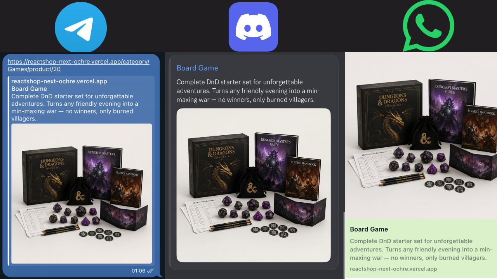
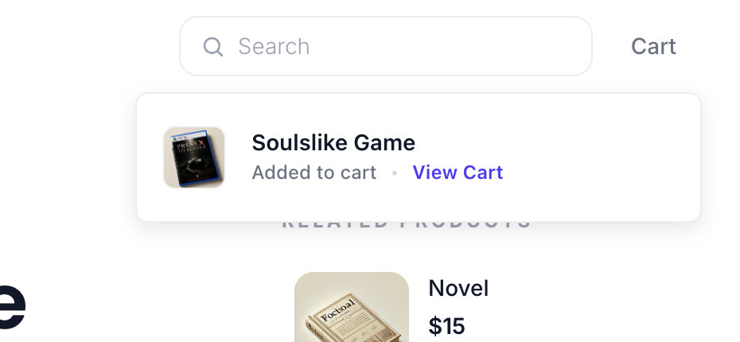
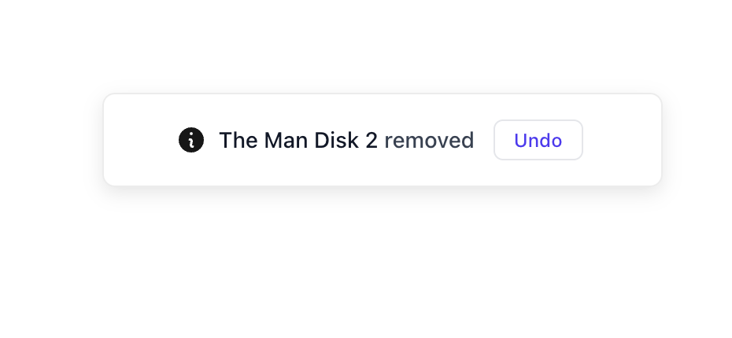
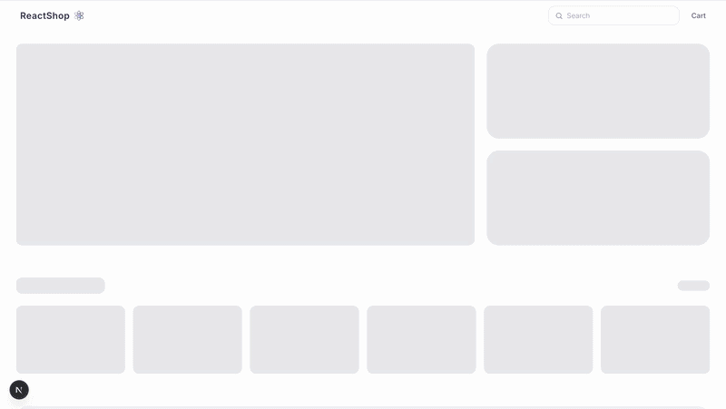

# 🛍️ ReactShop

A minimalist e-commerce storefront built with **React, TypeScript, and Next.js** — migrated from a Vite + React Router SPA to the App Router, with a focus on server-first rendering, SEO, faceted search, predictable cart state, and polished loading UX.

---

## 🎬 Preview

<p align="center">
  
</p>

---

## 🌐 Live Demo

👉 [ReactShop — Next.js](https://reactshop-next-ochre.vercel.app/)

Previous Vite version, kept live for comparison: [ReactShop — Vite](https://vite-react-ecommerce-jet.vercel.app/)

---

## 🚀 Features

- **Product Catalog** with category filtering and price sorting.
- **Product Details** with dynamically calculated related products.
- **Shopping Cart** — React Context + `useReducer`, with an **Undo** action for removed items.
- **Faceted Search** — multi-field matching, dynamic category counts, dual-thumb price range, sale filter.
- **Dynamic SEO Metadata** — per-product/category `generateMetadata`, Open Graph included.
- **Skeleton Loading** — route-level `loading.tsx` + `Suspense`, matched 1:1 to the real layout.
- **Error & Empty States** — real `404`s via `not-found.tsx`, broken-image fallback, empty search results.

---

## 🧠 Tech Stack

- **Frontend:** Next.js (App Router), React 19, TypeScript
- **Styling:** Tailwind CSS v4 (CSS-first `@theme` config)
- **Data:** Local JSON, read server-side via `fs/promises` — no client-side fetch for initial data
- **State:** React Context + `useReducer` (cart), `useState`/`useMemo` for UI-local state (filters, sort, facets)
- **UI:** Sonner (toasts), Lucide (icons)

---

## 🧩 Architecture & Decisions

### 1. 🔄 Migration: Vite SPA → Next.js App Router

| Before (Vite) | After (Next.js) |
|---|---|
| Client-rendered SPA | Server Components + streaming |
| React Router DOM | File-system routing (`app/`) |
| `useEffect` + `fetch` for data | `fs/promises` read directly in Server Components |
| Global `isLoading` state | Route-level `loading.tsx` + `Suspense` |
| Static, generic `<title>` | Dynamic `generateMetadata()` per page |
| `` | `next/image` with `priority`/`sizes` |

### ❗ Problem: client-rendered shell

The Vite SPA shipped an essentially empty <body>:

```html
<body>
  <div id="root"></div>
  <script type="module" src="/src/main.tsx"></script>
</body>
```

There's the issue: product data, categories, prices, and headings only existed after JS loaded.

Google does render JavaScript, but on a separate, delayed render queue — indexing can lag days or weeks behind raw HTML, which gets indexed immediately. Link-preview crawlers don't render JS at all: Open Graph scrapers for Slack, Twitter, and Facebook read raw HTML only, so a product link pasted into a chat would show a blank preview. And Google's JS rendering isn't the baseline either — Bing, DuckDuckGo, and others have weaker or no JS rendering support.

### ✅ Solution: Server Components render the initial HTML

```
Request → Server Component → read data → render HTML → browser gets real content → hydrate interactive parts
```

Called directly inside the page component — no "use client", no useEffect in sight — [page.tsx](https://github.com/KIB101D/reactshop-next/blob/main/app/(site)/category/%5BcategoryId%5D/page.tsx):

```ts
// No "use client", so this is a Server Component by default
export default async function CategoryPage({ params }: PageProps) {
  const { categoryId } = await params;
  const products = await getProducts();

  return <CategoryClient products={products} categoryId={categoryId} />;
}
```

💡 Because this runs on the server before the response is sent, the crawler and the OG scraper both receive the same fully-formed HTML the browser does — there's no JS execution step for them to skip.

---

### 🧩 Server + Client on the same URL

SEO doesn't require giving up interactivity. Every route that needs both is split into a thin server `page.tsx` (data + metadata) and a `*Client.tsx` (interactive slice):

```
category/[categoryId]/product/[productId]/
├── page.tsx                  # Server: product lookup, generateMetadata, 404
└── ProductDetailsClient.tsx  # Client: add to cart, gallery, quantity
```

[Product Page:](https://github.com/KIB101D/reactshop-next/blob/main/app/(site)/category/%5BcategoryId%5D/product/%5BproductId%5D/page.tsx):

```ts
export async function generateMetadata({ params }: PageProps): Promise<Metadata> {
  const { productId } = await params;
  const product = products.find((p) => p.id === Number(productId));

  return {
    title: `${product.title} — ReactShop`,
    description: product.description.slice(0, 160),
    openGraph: {
      title: product.title,
      description: product.description.slice(0, 160),
      images: [{ url: product.image }],
    },
  };
}
```

👉 Result:
<p align="center">
  
</p>

---

### 🛣️ Routing

React Router's `/category/:categoryId/product/:productId` became file-system routing: `app/(site)/category/[categoryId]/product/[productId]/page.tsx`. Dynamic segments live in the folder structure instead of a central router config.

#### 🔧 Other migration changes

- [`loading.tsx`](https://github.com/KIB101D/reactshop-next/blob/main/app/(site)/category/%5BcategoryId%5D/loading.tsx) per route instead of one global spinner
- [`not-found.tsx`](https://github.com/KIB101D/reactshop-next/blob/main/app/(site)/category/%5BcategoryId%5D/product/%5BproductId%5D/not-found.tsx) for a real `404` on a missing product
- `next/image` with `priority` on the LCP hero image ([`Hero.tsx`](https://github.com/KIB101D/reactshop-next/blob/main/app/components/Hero.tsx)) and per-breakpoint `sizes` elsewhere

---

### 2. 🔎 Advanced faceted search

#### ❗ Problem

Title-only search couldn't match on description, category, or tags, and the filter sidebar had no way to reflect what was actually in the result set.

#### ✅ Solution: multi-field search + derived facets

[`app/utils/filterProducts.ts`](https://github.com/KIB101D/reactshop-next/blob/main/app/utils/filterProducts.ts):

```ts
const filtered = products.filter(
  (product) =>
    product.title.toLowerCase().includes(normalizedQuery) ||
    product.tags.some((tag) => tag.includes(normalizedQuery)) ||
    product.description.toLowerCase().includes(normalizedQuery) ||
    product.categoryId.toLowerCase().includes(normalizedQuery) ||
    String(product.id) === query,
);
```

Facets (category counts, min/max price, sale count) are derived from the current result set in [`SearchClient.tsx`](https://github.com/KIB101D/reactshop-next/blob/main/app/(site)/search/SearchClient.tsx), then rendered by [`FilterSidebar.tsx`](https://github.com/KIB101D/reactshop-next/blob/main/app/components/FilterSidebar.tsx) as a dual-thumb price slider plus category checkboxes with live counts:

```
URL query → server page.tsx → filterProducts() → filtered set → SearchClient.tsx → facets + filters + sort
```

<!-- ⚠️ a gif of the filter sidebar in action — category checkbox toggling the grid, the price slider narrowing results, the mobile slide-over drawer. This is the single biggest feature with zero visual proof right now. -->

#### ⚡ `useMemo` 

```ts
const facets = useMemo(() => { /* categories, price bounds, sale count */ }, [filtered]);
const processedProducts = useMemo(() => { /* category/sale/price filtering */ },
  [filtered, selectedCategories, onlyOnSale, priceRange]);
```

`facets` is keyed only on `[filtered]`, so it doesn't recompute when `selectedCategories`, `onlyOnSale`, or `priceRange` change — only `processedProducts` does. I benchmarked this directly rather than guessing: at the catalog's actual size (46 products), one facet computation takes ~34µs. Simulating a session of price-slider drags (1,200 renders) shows the memoized version runs the computation once instead of 1,200 times — ~40ms saved in that session, a 100% reduction in redundant recomputation.

In absolute terms, 40ms on a 46-item catalog isn't the headline — the real point is that the cost is now O(1) per search instead of O(interactions), so it stays flat as the catalog grows. I'm not claiming a dramatic raw number because there isn't one at this scale; the repo also doesn't have a before/after React Profiler trace, so I'm not asserting more than the benchmark shows.

---

### 3. 🛒 Reducer-based cart state with undo

#### ❗ Problem

Adding or removing items gave no confirmation, so accidental removals were hard to recover from.

#### ✅ Solution

Cart state lives in [`CartProvider.tsx`](https://github.com/KIB101D/reactshop-next/blob/main/app/context/CartProvider.tsx) via `useReducer`, with explicit actions (`ADD_TO_CART`, `REMOVE_FROM_CART`, `INCREMENT`, `DECREMENT`, `CLEAR_CART`, `RESTORE_ITEM`), wired directly to Sonner toasts:

```ts
function removeFromCart(productId: number) {
  const item = cart.find((i) => i.id === productId);
  dispatch({ type: "REMOVE_FROM_CART", payload: productId });
  showRemoveFromCartToast(item, () => {
    dispatch({ type: "RESTORE_ITEM", payload: item });
  });
}
```

**Instant feedback** — adding a product triggers a confirmation toast with a deep link to the cart.

<p align="center">
  
</p>

**Undo rollback** — removing a product snapshots it before dispatch, so the toast's undo button restores it via `RESTORE_ITEM`.

<p align="center">
  
</p>

<!-- ⚠️ these two screenshots exist for the Vite version but not in this repo yet. The component is functionally identical, but will re-shoot them from the Next build rather than copying the old files — the toast styling/position changed slightly (Toaster is now positioned with a top offset for the sticky header). -->

---

### 4. ⏳ Skeleton loading

#### ❗ Problem

Local JSON loads instantly, but the artificial delay added to category pages (and any real API in production) isn't instant — a full-page spinner caused layout jumps.

#### ✅ Solution

`HomeSkeleton`, `ProductCardSkeleton`, and per-route `loading.tsx` files mirror the real layout exactly, built *after* the real JSX existed — specifically to keep Cumulative Layout Shift at zero.

<p align="center">
  
  <br />
  <sub>Home page skeleton state</sub>
</p>

<p align="center">
  
  <br />
  <sub>Product page skeleton state</sub>
</p>

<!-- ⚠️ these two gifs are from the Vite repo. Will re-record them: the Next version's skeletons are driven by Suspense/loading.tsx now, not a useState isLoading flag, so the trigger mechanism is genuinely different even if the visual result looks similar. -->

---

## 🧱 Project Structure

```
app/
├── (site)/                          # Route group — pages only, doesn't affect URLs
│   ├── page.tsx                     # Home (streams Hero/Categories/FlashSale/Featured)
│   ├── category/[categoryId]/
│   │   ├── page.tsx                 # Server: fetch + filter by category
│   │   ├── CategoryClient.tsx       # Client: sort + grid
│   │   └── product/[productId]/
│   │       ├── page.tsx             # Server: fetch product + related items
│   │       └── ProductDetailsClient.tsx
│   ├── search/
│   │   ├── page.tsx                 # Server: reads ?q= via searchParams
│   │   └── SearchClient.tsx         # Client: facets, filters, sort
│   ├── cart/page.tsx
│   ├── about/page.tsx
│   └── support/page.tsx
├── components/                      # Shared UI (Header, Footer, cards, badges…)
├── context/CartProvider.tsx         # Cart state (useReducer)
├── lib/data/                        # Server-side data access (fs-based)
└── types/                           # Shared TypeScript types
```

---

## 🛠️ Installation

```bash
npm install
npm run dev
```

Production build:

```bash
npm run build
npm run start
```

---

## 📌 Future improvements

- Add `sitemap.ts` for product/category discovery.
- Add structured data (`Product`, `Offer`, `BreadcrumbList` JSON-LD).
- Decide on and implement an explicit indexing policy for `/search` (currently no `robots.txt` or per-route `noindex` exists — the earlier draft claimed `/search` was excluded from indexing; it isn't yet, unless added).
- Profile search interactions in production mode to get a real Profiler trace, not just the synthetic Node benchmark above.
- Consider static generation/caching for stable product and category routes.
